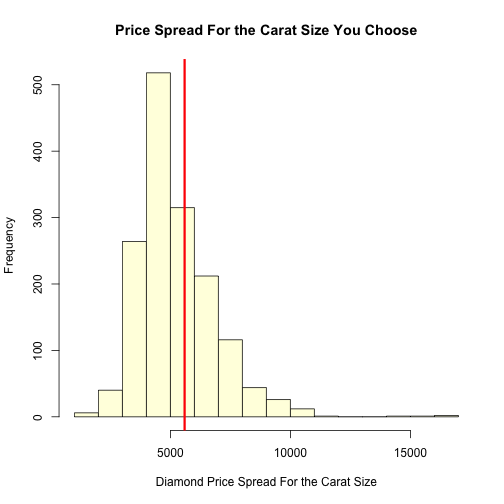
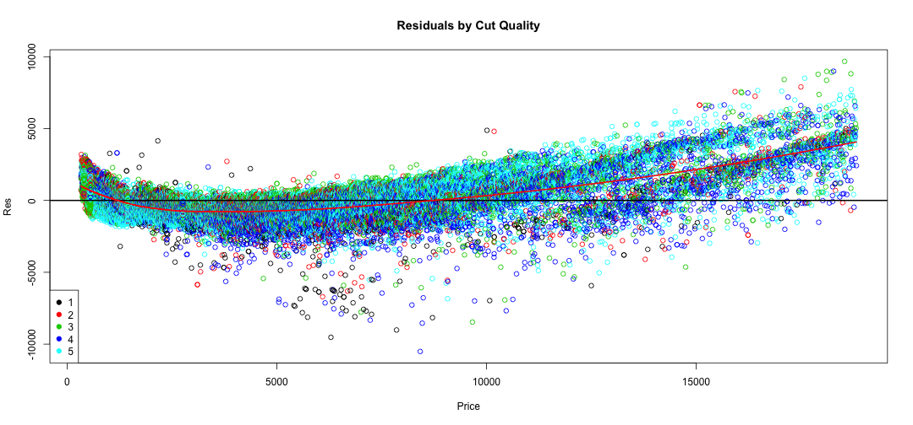

Estimate My Diamond
========================================================
author: Barbara Dornseif - Saoirsegirl
date: May 23, 2015

Why Do I Need An Estimator?
========================================================
US diamond purchases toped $600 millions in value in 2013

The top occassions for a Diamond purchases are:  
- Wedding Rings - 75 % 
- Anniversaries - 15 % 
- Birth of a Baby - 5 % 
- All Other Occassions - 5 % 

Choosing the 4 C's
========================================================
- Diamond buyers need a model to help pick the right stone.  

- Keep it simple and it will drive additional sales to your site.  
 
- Just 4 inputs give a range of possibilities for every budget.  

$$
    \beta_0 + \beta_1(carat) + \beta_2(cut) + \beta_3(color) + \beta_4(clarity)
$$ 

- Our model fills in the $\beta$ 's the customer fills in the C's  

<small>Cut and Clarity capture 95+% of the price variation represented by: depth%, table%, and the 3 co-ordinates of table, crown and height. Given new (and even some seasoned) buyers will be less likely to know of or have experience with these specifications, it is better to "keep it simple".</small>

Model SnapShot
========================================================
left:60%
 
***
- A correlation of the other 3 C's is provided with the estimate  
- Future models will have all 4 C's incorporated in the graphical display. so the graph shows only the reference that meet all 4 criteria.

Model Accuracy for Cut
========================================================

 

Cut Values: 1 -- Fair > Good > Very Good > Premium > Ideal -- 5  
<small>The model is most accurate around the $4,000 mark - underestimating smaller gems and over estimating larger ones. This chart also shows over estimations of more expensive gems. Not a bad place to start a sales negotiation.
